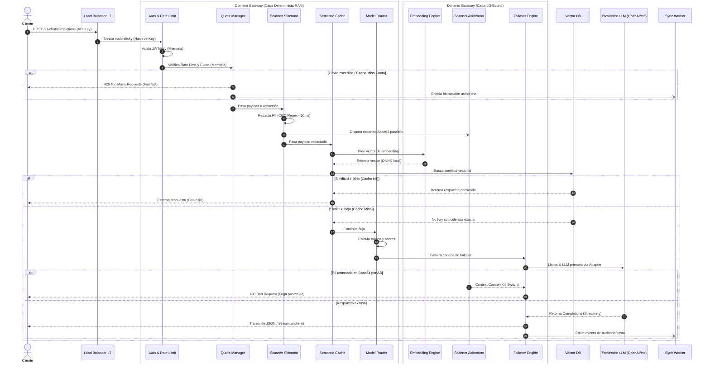

# Flujo Core de Petición (API LLM Gateway)

Este flujo describe el ciclo de vida completo de una petición que pasa por los componentes documentados en la arquitectura C4 (Capa Determinista y Capa I/O-Bound), asegurando alineación con los límites de contenedores y los Criterios de Aceptación (HU-006, HU-026, HU-032, etc.).

