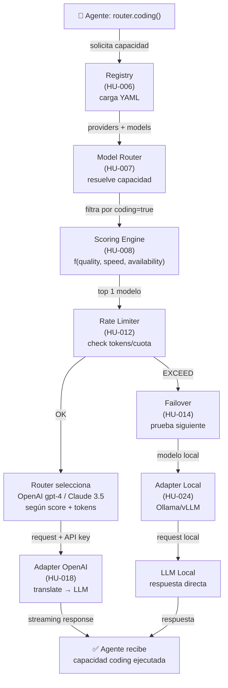

# EP-001: Flujo de Enrutamiento Dinámico

Flujo de selección de modelo basado en capacidad y score.

## Historias Críticas

| Historia | Fase | Rol |
|----------|------|-----|
| HU-006 | 1 | Carga declarativa YAML |
| HU-007 | 1 | Resolución capacidad → modelo |
| HU-008 | 1 | Scoring dinámico (calidad × velocidad × costo) |
| HU-012 | 1 | Rate limiting + quota enforcement |
| HU-014 | 2 | Failover transparente ante 429/500 |
| HU-018 | 1 | Adapter OpenAI (traducción de API) |
| HU-024 | 1 | Adapter locales (Ollama/vLLM) |

## Camino Feliz
1. Agente solicita `router.coding()`
2. Registry carga providers YAML
3. Router resuelve gpt-4 como top scorer
4. Rate limiter verifica cuota (OK)
5. Adapter OpenAI traduce request
6. LLM responde → agente recibe

## Camino de Fallos
- **Sin cuota OpenAI**: Failover a Claude 3.5 (next score)
- **Sin cuota remota**: Fallback a Ollama local (HU-024)
- **Sin modelos disponibles**: Error 503 Service Unavailable

## SLA Asociado
- **Latencia router**: < 100ms p95 (overhead)
- **Disponibilidad global**: 99.9% (HA multirégión)
- **TTFT (Time-to-First-Token)**: 2.0s strict para chat/code, 5.0s para vision
