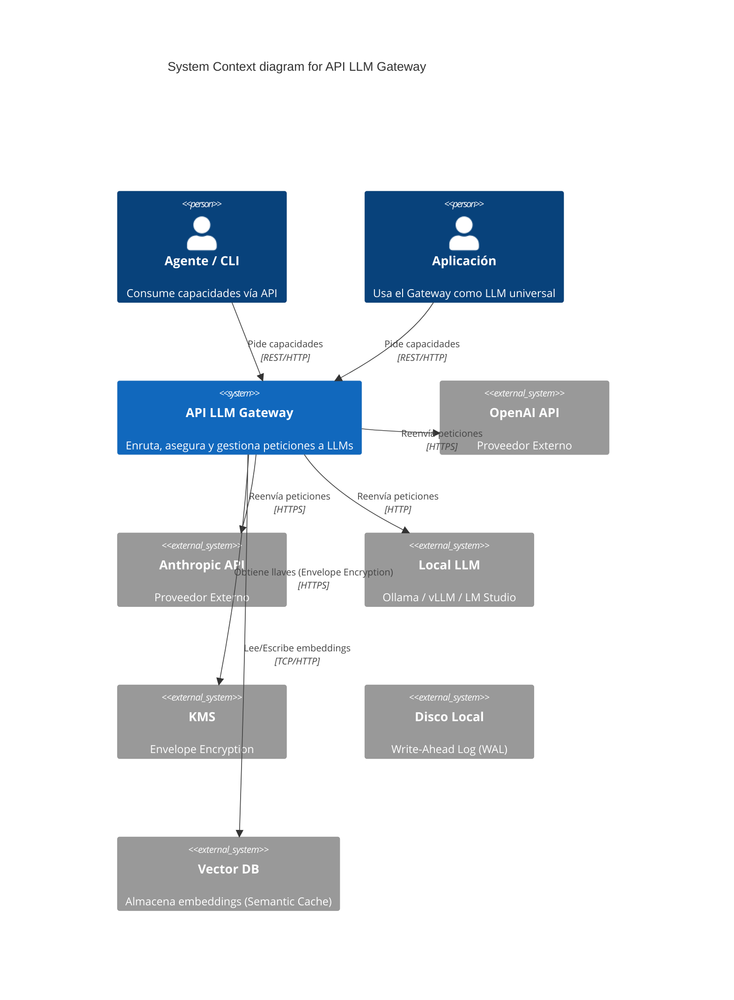
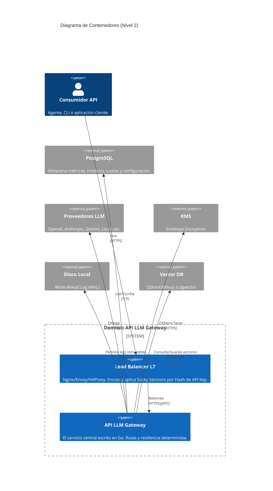

# Documento de Arquitectura: API LLM Gateway

## 1. Selección de Stack

**Decisión**: Go (Golang)

> **Referencia**: Ver [ADR-001: Backend en Go (Golang)](../../12-adr/ADR-001-backend-stack.md) para la justificación completa de esta decisión arquitectónica.

**Alternativas Evaluadas:**
1. **Go (Golang) [SELECCIONADA]**
   - *Pros*: Rendimiento estelar y bajísima latencia, manejo de concurrencia nativo (goroutines) ideal para un proxy/gateway de red, tipado fuerte estático, compilación a binario único.
   - *Cons*: Ecosistema de SDKs de IA más pequeño comparado con Python.
2. **Python + FastAPI**
   - *Pros*: Ecosistema nativo de IA (LangChain, LlamaIndex), excelente validación con Pydantic, muy adoptado en este dominio.
   - *Cons*: Mayor consumo de memoria, el asincronismo y el GIL pueden limitar la alta concurrencia real sin escalar horizontalmente, gestión de dependencias más compleja.
3. **Node.js + TypeScript (Fastify)**
   - *Pros*: Alto throughput asíncrono, excelente ecosistema y velocidad de desarrollo.
   - *Cons*: Validar schemas (Zod/TypeBox) es manual comparado con Pydantic/Structs, menor rendimiento CPU-bound.

**Trade-offs y Justificación:**
Se seleccionó Go porque el Gateway actúa principalmente como un enrutador de red (I/O intensivo) donde latencias bajas (< 100ms) y alta concurrencia son críticas. Al no realizar entrenamiento ni procesamiento intensivo de IA localmente, el ecosistema masivo de Python no es estrictamente necesario, y los beneficios de Go en despliegue (binario estático) y rendimiento superan las limitantes de su ecosistema LLM.

## 2. C4 Model - Nivel 1: System Context



## 3. C4 Model - Nivel 2: Container



## 4. C4 Model - Nivel 3: Component (Gateway API)

```mermaid
C4Component
      title Diagrama de Componentes (Nivel 3) - API LLM Gateway

      Container_Boundary(api, "Gateway API") {
        Component(auth, "Auth & Rate Limit (Fase 1)", "Middleware", "Valida JWT/Keys (memoria).")
        Component(redact, "Scanner Síncrono (Fase 1)", "Middleware", "Redacta PII (CGO/Regex) en <10ms.")
        Component(async_scan, "Scanner Asíncrono (Fase 1)", "Worker", "Kill-Switch profundo para Base64.")
        Component(prompt_guard, "Prompt Guardian (Fase 1)", "Engine", "Optimización semántica (opt-in).")
        Component(semantic_cache, "Semantic Cache (Fase 2, HU-032)", "Middleware", "Busca hit semántico >98% vía vector search local")
        Component(embedding, "Embedding Engine (Fase 2)", "Worker", "Genera embeddings localmente (ONNX)")
        Component(handler, "LLM Handler (Fase 1)", "Go Controller", "Recibe la petición y orquesta.")
        Component(config, "Registry (Fase 1)", "Go", "Carga declarativa YAML (providers/models/capabilities/API keys) a RAM en arranque.")
        Component(quota, "Quota Manager (Fase 1)", "Local RAM Cache", "Verifica cuota en memoria al instante.")
        Component(router, "Model Router (Fase 1)", "Engine", "Estima tokens y calcula scores.")
        Component(health, "Health Monitor (Fase 1)", "Worker", "Prueba disponibilidad/latencia/429-500 por proveedor; alimenta la Disponibilidad del score.")
        Component(fallback, "Failover Engine (Fase 1)", "Service", "Ejecuta petición y reintenta; termina en modelos locales.")
        Component(adapter_oa, "Adapter OpenAI (Fase 1)", "Interface", "Adaptador")
        Component(adapter_anth, "Adapter Anthropic (Fase 1)", "Interface", "Adaptador")
        Component(adapter_local, "Adapter Local (Fase 1)", "Interface", "Ollama/vLLM/LM Studio (cierre de cadena de failover).")
        Component(learning, "Learning Engine (Fase 3)", "Engine", "Ajusta pesos del score con histórico. Diferido a Fase 3; no activo en MVP.")
        Component(sync_worker, "Sync Worker (Fase 1, HU-038)", "Worker", "Sincroniza asíncronamente; cifra vía KMS Envelope.")
        Component(cache_invalidator, "Cache Invalidator (Fase 2, HU-041)", "Worker", "Webhook/Polling para refresco en caliente.")
      }
      System_Ext(llm, "Proveedores LLM", "APIs")
      System_Ext(db, "PostgreSQL", "DB Particionada (Mes/Tenant)")
      System_Ext(kms, "KMS", "Custodia la llave AES maestra (Envelope Encryption).")
      System_Ext(wal, "Disco Local", "Write-Ahead Log (WAL)")
      System_Ext(vector_db, "Vector DB", "Qdrant/Milvus o pgvector")

      Rel(handler, redact, "Filtra texto")
      Rel(handler, async_scan, "Lanza escaneo de Base64")
      Rel(async_scan, handler, "Señal de interrupción (Context Cancel)")
      Rel(handler, prompt_guard, "Optimiza (opcional)")
      Rel(handler, semantic_cache, "Verifica caché semántica")
      Rel(semantic_cache, embedding, "Pide embedding local")
      Rel(semantic_cache, vector_db, "Búsqueda vectorial")
      Rel(handler, quota, "Chequea (O(1)) y aplica Fail-fast (Retry-After) en Cache Miss")
      Rel(handler, router, "Estima tokens y resuelve")
      Rel(router, config, "Consulta Registry")
      Rel(router, fallback, "Genera cadena")
      Rel(fallback, adapter_oa, "Intenta")
      Rel(fallback, adapter_anth, "Si falla, intenta")
      Rel(fallback, adapter_local, "Si toda la cadena remota falla, degrada a local")
      Rel(adapter_oa, llm, "API Call")
      Rel(adapter_anth, llm, "API Call")
      Rel(health, router, "Publica disponibilidad/latencia por proveedor")
      Rel(health, llm, "Prueba periódica (health check)")
      Rel(learning, config, "Ajusta pesos del score (Fase 3)")
      Rel(learning, db, "Lee histórico de decisiones")
      Rel(handler, sync_worker, "Envía evento asíncrono")
      Rel(sync_worker, kms, "Envuelve/desenvuelve llave AES", "Envelope")
      Rel(sync_worker, wal, "Flushea logs inmutables continuamente", "File I/O asíncrono")
      Rel(sync_worker, db, "Flush/Inserta", "KMS Envelope asíncrono")
      Rel(sync_worker, db, "Lee keys/cuotas para hidratar caché en boot", "TCP")
      Rel(sync_worker, quota, "Actualiza memoria (Pre-warming)")
      Rel(sync_worker, auth, "Actualiza auth (Pre-warming)")
      Rel(config, db, "Lee config YAML/DB en arranque", "TCP")
      Rel(quota, sync_worker, "Encolar hidratación asíncrona", "channel")
      Rel(cache_invalidator, db, "Poll/Escucha")
      Rel(cache_invalidator, quota, "Invalida keys/cuotas (Stale Cache)")
      Rel(cache_invalidator, auth, "Invalida Auth (Stale Cache)")
      ```

### 1. El límite duro: Capa Determinista vs Capa de I/O
El Gateway divide estructuralmente su código en dos hemisferios para garantizar SLA de routing < 100ms (overhead p95 < 100ms exclusivamente de enrutamiento, no contando latencia externa del proveedor):

1. **Capa Determinista (RAM & CPU I/O)**: 
   - Recepción HTTP, Autenticación (JWT/Key validado en memoria).
   - Config Manager (Lee un YAML/DB *una sola vez en el arranque* y lo mantiene en memoria).
   - Router de score y desempate.
   - Evaluación de límite de cuota y rate limits (`Local RAM Cache`).
   - Cero I/O de red, cero I/O a base de datos.
2. **Capa asíncrona / I/O-Bound (Red & DB)**: 
   - `Semantic Cache (Fase 2, HU-032)`: Aunque intercepta el routing, realiza I/O de red hacia PostgreSQL (pgvector) e incluye **Embedding Engine** (generación local de vectores vía ONNX). Es la única excepción en la ruta crítica, mitigada con un timeout extremo de 10ms y fail-open. Diferida a Fase 2; no activa en MVP Fase 1.
   - `Adapters`: Ejecutan la llamada al LLM por red.
   - `Sync Worker`: Obtiene llaves maestras de KMS (para cifrado de sobre local) y escribe/hidrata la DB de forma completamente asíncrona mediante channels (canales) de Go. Implementa un **Graceful Shutdown** (con WAL (Write-Ahead Log) local obligatorio) para vaciar buffers a DB en caso de crash y evitar pérdida de logs/cuota.
   - `Cache Invalidator` (Fase 2): Webhook o background polling que actualiza o invalida cuotas y keys on-the-fly para solucionar inconsistencias si la DB es modificada externamente. No implementada en MVP Fase 1; ante un Cache Miss, el Quota Manager falla rápido (Fail-fast 401/429 con header `Retry-After: 1`) y encola la hidratación asíncrona, manteniendo el SLA de 0 I/O. Será crítica cuando multi-tenant scenarios requieran refresco dinámico de cuotas.
   - `Kill-switch asíncrono profundo`: Un worker paralelo (goroutine) que escanea Base64. Al detectar PII, propaga una cancelación del `context.Context` (a través del router y adapter hasta la conexión HTTP externa) abortando la generación en vuelo.

### 2. Infraestructura: L7 Sticky Sessions
Para soportar balanceo multi-nodo preservando la velocidad extrema de la capa determinista, la arquitectura depende de un Load Balancer L7 (Nginx/Envoy) por delante del Gateway. El balanceador genera un hash a partir de la API Key (o Tenant ID) en los headers, asegurando que el mismo cliente caiga en el mismo nodo. Esto elimina el problema de "quota-drift" o discrepancias temporales de saldo en la RAM de diferentes nodos sin requerir un clúster complejo de Redis distribuido.

### 3. Mapping Componentes: Ubicación × Latencia × Capa

| Componente | Fase | Ubicación | Latencia p95 | Capa | I/O | Notas |
|---|---|---|---|---|---|---|
| Auth & Rate Limit | Fase 1 | RAM (memoria) | <5ms p99 | Determinista | Ningún I/O | O(1) lookup |
| Scanner Síncrono | Fase 1 | CPU local (CGO/Regex) | <10ms | Determinista | Ningún I/O | Payload < 10MB |
| Scanner Asíncrono | Fase 1 | Goroutine paralela | Variable | Asíncrona | Ningún I/O crítico | No bloquea Handler |
| Prompt Guardian | Fase 1 | CPU local | <1.5s | Determinista (opt-in) | Ningún I/O | Relaja SLA si activo |
| Registry (Config) | Fase 1 | RAM (memoria) | <1ms | Determinista | I/O DB en boot | Solo carga al arrancar |
| Quota Manager | Fase 1 | RAM (memoria) | <1ms | Determinista | Cache Miss → async | O(1) lookup |
| Model Router | Fase 1 | CPU + RAM | <5ms | Determinista | Ningún I/O | Score calculation |
| Health Monitor | Fase 1 | Worker paralelo | ~1-5s (periodic) | Asíncrona | I/O red (LLM checks) | Alimenta router scores |
| Failover Engine | Fase 1 | Adapter chain | Variable | Asíncrona | I/O red | Retries hasta local |
| Adapters (OpenAI, Anthropic, Local) | Fase 1 | Go goroutines | Variable (2-30s) | Asíncrona | I/O red (LLM) | TTFT 2.0s std / 5s vision / <30s reasoning |
| Semantic Cache | Fase 2 | Vector DB + PostgreSQL | <10ms (fail-open) | Asíncrona (ruta crítica) | I/O red (vector search) | No en MVP Fase 1 |
| Embedding Engine | Fase 2 | CPU local (ONNX) | <100ms | Asíncrona | Ningún I/O red | Genera vectores localmente |
| Sync Worker | Fase 1 | Goroutine + channels | Async (batches 1s/1000 ev) | Asíncrona | I/O DB (asincrónica) | KMS Envelope + WAL |
| Learning Engine | Fase 3 | Worker + DB | Variable (delayed) | Asíncrona | I/O DB (histórico) | No en MVP Fase 1 |
| Cache Invalidator | Fase 2 | Worker (polling/webhook) | ~30s polling | Asíncrona | I/O DB (polling) | No en MVP Fase 1 |
| Kill-Switch (PII async) | Fase 1 | Goroutine paralela | Variable | Asíncrona | Ningún I/O crítico | Abort en vuelo |

- **Throughput**: **500 RPS continuos globales** = suma de capacidad de todos los proveedores en failover. Ejemplo: OpenAI 250 RPS + Anthropic 150 RPS + AIHubMix 100 RPS = 500 RPS global. Cada proveedor tiene su Max In-Flight independiente. Esto requiere múltiples proveedores activos en paralelo para alcanzar el throughput declarado.
- **Streaming Obligatorio**: Para evitar colapsos de RAM (OOM) con payloads de hasta 50MB a 2,500 conexiones concurrentes, el procesamiento del Gateway utiliza buffers de streaming de principio a fin.
- **Circuit Breaker y Concurrencia**: Se establece un límite de peticiones en vuelo (Max In-Flight **configurable por proveedor en YAML, ej. 300 a 500 peticiones para top tiers**) para prevenir *Failover Suicide*. El valor es declarativo por proveedor (no hardcodeado); si se supera, el circuito se abre preventivamente (Fast Fail) sin esperar el timeout. Adicionalmente, el tráfico de visión está estrictamente limitado a 2 peticiones concurrentes por nodo para evitar bufferbloat.
- **Timeouts Dinámicos**: TTFT (Time To First Token) es adaptativo por capacidad. Estándar (chat/código) = 2.0s; Reasoning = configurable (ej. < 30s) para permitir pensamiento prolongado. Stream Idle Timeout (pausa mid-stream) = configurable por modelo (ej. 5s) para cortar streams colgados sin penalizar LLMs que piensan entre tokens.
- **Protección de Red**: Se configurará un `ReadHeaderTimeout` estricto a nivel servidor Go para prevenir ataques Slowloris.
## 5. Objetivos de Resiliencia (RTO / RPO)

- **RTO (Recovery Time Objective)**: < 1 hora. En caso de caída del Gateway, los nodos pueden recuperarse en < 1h mediante WAL local + re-sincronización con DB.
- **RPO (Recovery Point Objective)**: < 15 minutos. En caso de pérdida de datos, el máximo de peticiones sin persistencia = 15 minutos de buffer en WAL local.

Estos objetivos están detallados en `docs/10-tech-discovery/api-llm-gateway.md` § Recuperación.

## 6. Modelo de Datos y Particionamiento

El almacenamiento relacional (PostgreSQL) contará con una estrategia de **Particionamiento por Rango de Fecha** (mensual) o por Tenant ID para la tabla de AuditLog, que debe soportar inserciones masivas (~43M/día).

El esquema constará de:

- **Tenant**: `id`, `name`, `created_at`
- **ApiKey**: `id`, `tenant_id`, `key_hash`, `scopes`, `rate_limit_rpm`
- **Quota**: `id`, `tenant_id`, `provider`, `max_tokens_monthly`, `used_tokens`
- **AuditLog**: `id`, `request_id`, `tenant_id`, `agent_id`, `capability`, `provider`, `model`, `tokens_prompt`, `tokens_completion`, `cost`, `latency_ms`, `status_code`, `timestamp`

*Nota: Los prompts y responses no se guardan en el AuditLog por defecto para evitar fugas de PII.*


## Trade-offs Aceptados (Round 10)
- **Quota-drift temporal por caída de nodo**: Si un nodo muere abruptamente, su consumo reciente queda en su WAL local. El balanceador enviará al usuario a otro nodo que tendrá una caché desactualizada, permitiendo un leve sobreconsumo hasta que el nodo muerto reviva y procese su WAL.
- **Hot Config Refresh**: Se asume que cambios de enrutamiento requerirán un reinicio (rolling deployment) en Fase 1.
- **Fail-Fast Delegation**: El retorno de `Retry-After: 1` delega el reintento temporal al cliente (ej. SDK oficial de OpenAI) para mantener 0 I/O síncrono.
- **PII Leak en Async Scan**: El escaneo profundo en archivos base64 es asíncrono; se acepta una breve ventana de exposición hacia el proveedor antes del kill-switch a favor del TTFT.
