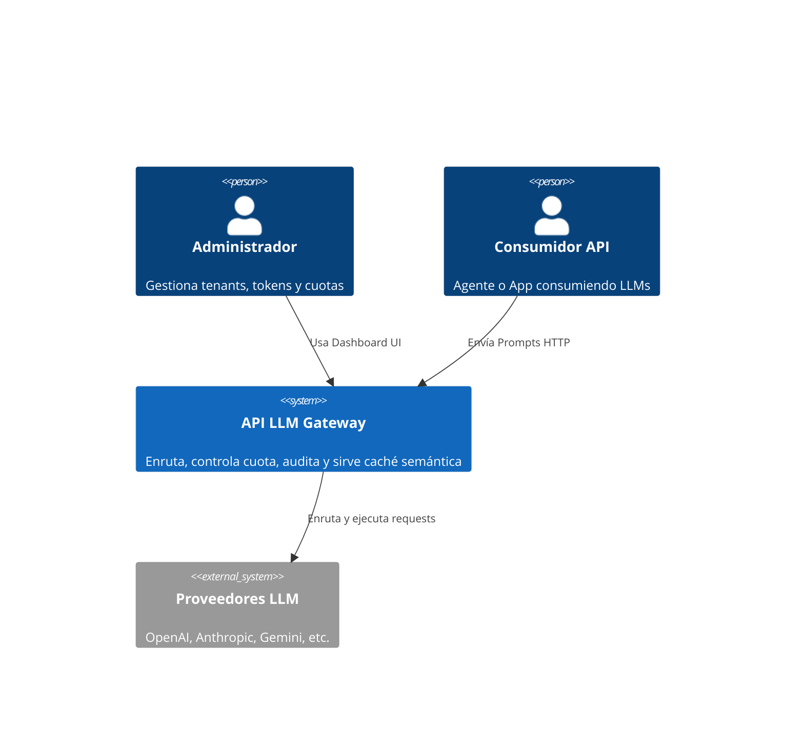
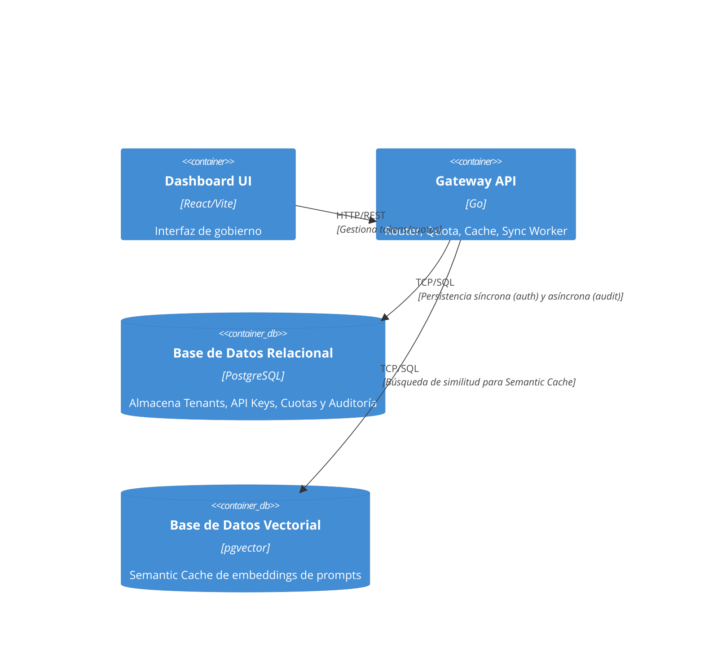
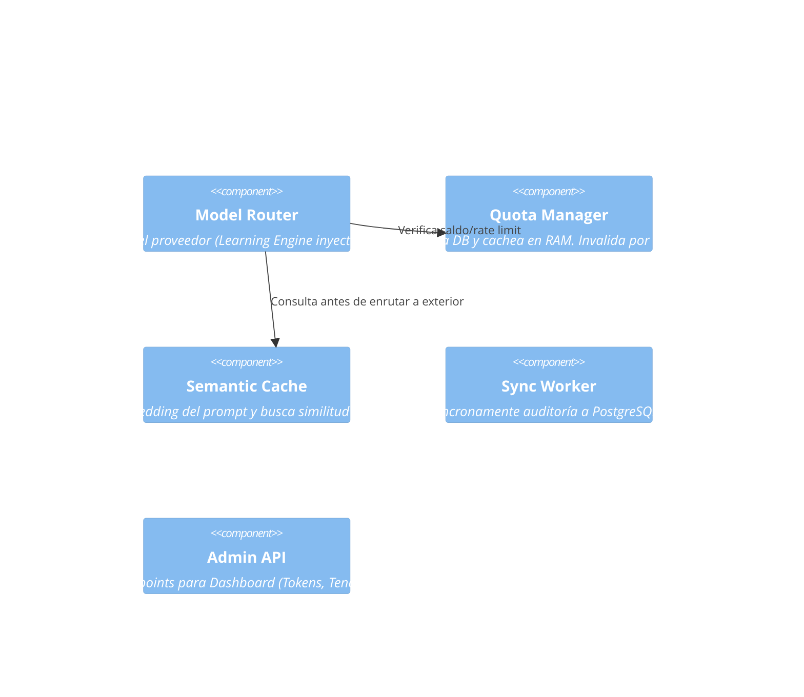

# Arquitectura C4 - Fase 2 (Autonomía y Gobernanza)

## Contexto de Sistema (C1)

```mermaid
C4Context
  Person(admin, "Administrador", "Gestiona tenants, tokens y cuotas")
  Person(client, "Consumidor API", "Agente o App consumiendo LLMs")
  System(gateway, "API LLM Gateway", "Enruta, controla cuota, audita y sirve caché semántica")
  System_Ext(llm, "Proveedores LLM", "OpenAI, Anthropic, Gemini, etc.")
  
  Rel(admin, gateway, "Usa Dashboard UI")
  Rel(client, gateway, "Envía Prompts HTTP")
  Rel(gateway, llm, "Enruta y ejecuta requests")
```

## Contenedores (C2)

```mermaid
C4Container
  Container(dashboard, "Dashboard UI", "React/Vite", "Interfaz de gobierno")
  Container(api, "Gateway API", "Go", "Router, Quota, Cache, Sync Worker")
  ContainerDb(db_rel, "Base de Datos Relacional", "PostgreSQL", "Almacena Tenants, API Keys, Cuotas y Auditoría")
  ContainerDb(db_vec, "Base de Datos Vectorial", "pgvector", "Semantic Cache de embeddings de prompts")
  
  Rel(dashboard, api, "HTTP/REST", "Gestiona tokens/cuotas")
  Rel(api, db_rel, "TCP/SQL", "Persistencia síncrona (auth) y asíncrona (audit)")
  Rel(api, db_vec, "TCP/SQL", "Búsqueda de similitud para Semantic Cache")
```

## Componentes Gateway (C3)

```mermaid
C4Component
  Component(router, "Model Router", "Decide el proveedor (Learning Engine inyecta pesos)")
  Component(quota, "Quota Manager", "Consulta DB y cachea en RAM. Invalida por eventos.")
  Component(cache, "Semantic Cache", "Calcula embedding del prompt y busca similitud en Vector DB")
  Component(sync, "Sync Worker", "Escribe asíncronamente auditoría a PostgreSQL (usa WAL)")
  Component(admin_api, "Admin API", "Endpoints para Dashboard (Tokens, Tenants)")
  
  Rel(router, cache, "Consulta antes de enrutar a exterior")
  Rel(router, quota, "Verifica saldo/rate limit")
```
