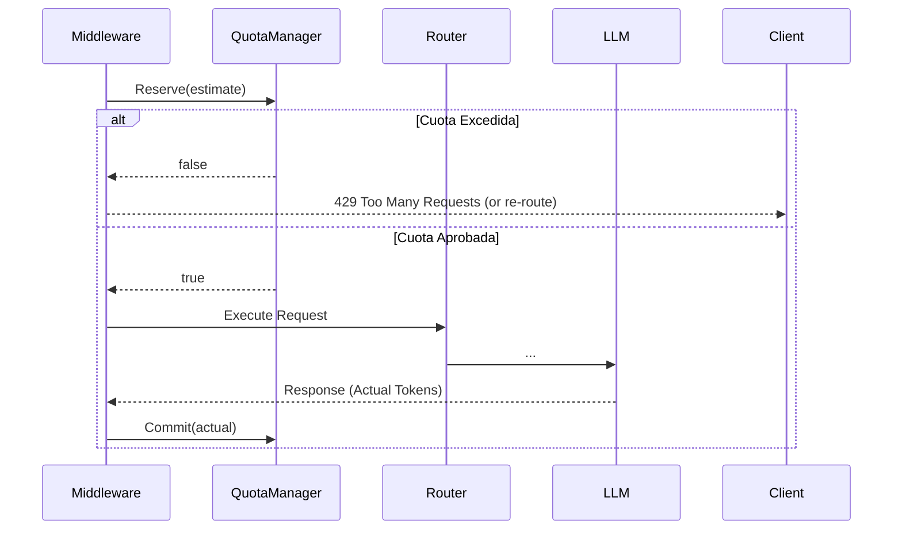

# Design: Gobernanza de consumo

## Arquitectura de Validación de Cuota (Quota Manager)
La gestión de cuotas será delegada a una capa middleware o de servicio que intercepta cada Request antes de ejecutar el ruteo (o durante la fase de selección).

Se implementará un estado en memoria thread-safe (`sync.RWMutex` o similar) para mantener el conteo diario.
Almacenaremos las cuotas agrupadas por llave, combinando `ProviderID`, `AgentID` y `Ventana Temporal` (por ejemplo: `yyyy-mm-dd`).

## Arquitectura de Rastreo de Costos (Cost Tracker)
Para el tracking de costos, inyectaremos un módulo interceptor (`CostTracker`) una vez que el Router haya finalizado y devuelto una respuesta HTTP (sea de OpenAI o Anthropic). Evaluaremos el costo buscando el `Model` en el `Registry`, multiplicando por el `cost_per_token`.

En escenarios de streaming:
Se envolverá la conexión/Flusher con un iterador de contadores que sume `CompletionTokens` por cada bloque emitido al cliente. Al recibir un EOF o conexión abortada (`context.Canceled`), se despachará el conteo a `CostTracker` para su registro en background y posterior flush a WAL.
